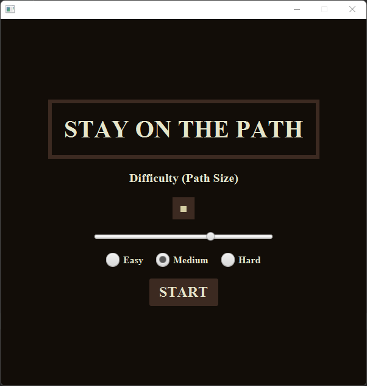
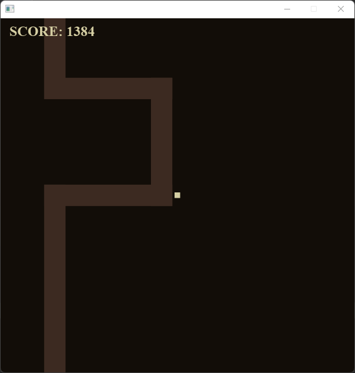
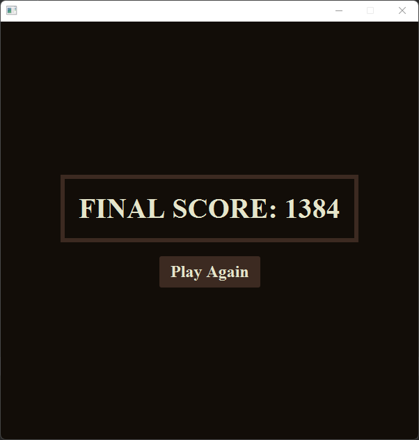

# walls-are-bad
A short and sweet replayable game using the JavaFX Canvas class where the player needs to stay within the lines or fall to their doom!

# Level:
Capstone

# Learned:
- The fundamentals of JavaFX
- How to create UI elements without using a FXML file
- How to add CSS styling to the JavaFX elements through code
- How to do slight animation (the player dying)
- How to work with the canvas as well as a layer with UI elements ontop
- Working with player movement
- Handling events from a UI application
- Providing customizable options for desired difficulty through an interactive menu
- Working with colors through hexadecimal codes
- Working with game states to move the player from the title screen, to the game, and then to the end screen
- Working with 
- Using enums
- Refactoring code
- Working with ArrayLists; keeping only so many objects in memory at once (culling ones that are no longer in scope)
- Working with a game loop and frames per second
- Handling physics and collision detection
- Designing the application in a way that would make it easy to change parameters, the graphics, and the difficulty

# Gameplay Screenshots

The Title Screen

The Main Game

The Score/End Screen

